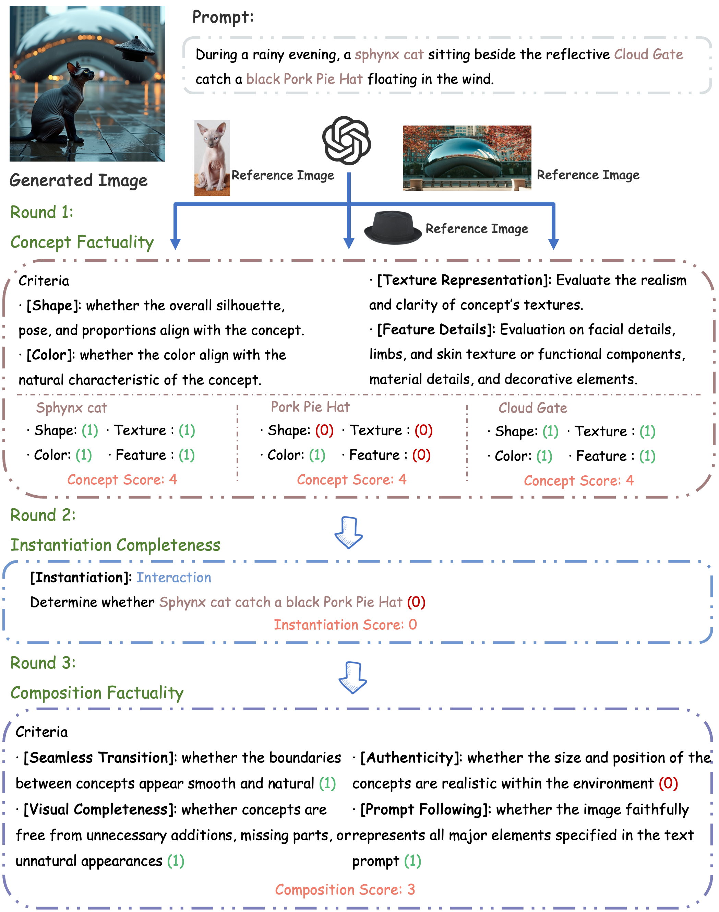

# T2I-FactualBench: Benchmarking the Factuality of Text-to-Image Models with Knowledge-Intensive Concepts

## Introduction

This repository contains code and links to the paper "T2I-FactualBench: Benchmarking the Factuality of Text-to-Image Models with Knowledge-Intensive Concepts". T2I-FactualBench is the benchmark to evaluate the factuality of text-to-image models when generating images that involves knowledge-intensive concepts. We propose a three-tiered knowledge-intensive text-to-image generation framework, spanning from the basic memorization of individual knowledge concepts to the more complex composition of multiple knowledge concepts. To conduct an effective and efficient evaluation, we also introduce a multi-round visual question answering (VQA)-based evaluation framework aided by advanced multi-modal LLMs.

## Multi-Round VQA

This Multi-Round VQA framework consists of three VQA tasks: (1)Concept Factuality Evaluation; (2) Instantiation Completeness Evaluation and (3) Composition Factuality Evaluation

## Leaderboard

Want to submit results on the leaderboard? Please email the authors.

## Example Cases of Diverse Generations by Models on T2I-FactualBench 

### SKCM

### SKCI

### MKCC

## Release

- [ ] Release the code for generating prompts and evaluation.
- [ ] Release images generated by different models.
- [ ] Release 1600 knowledge-intensive concepts and 3000 prompts of T2I-FactualBench.
- [x] Release the paper of T2I-FactualBench on arXiv. 